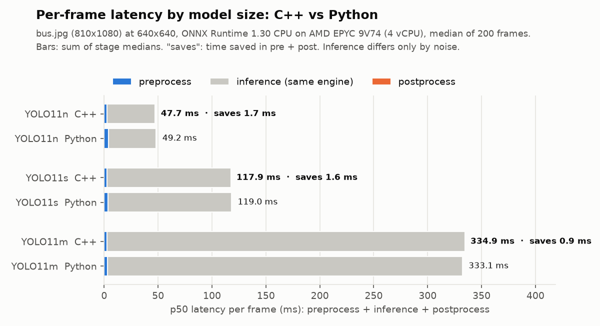

# takt-vision

**A real-time C++20 vision inference pipeline:** camera to detections to tracked objects, with
bounded latency you can measure, benchmarked against the equivalent Python pipeline.

[](https://github.com/GBR-RL/takt-vision/actions/workflows/ci.yml)
[](https://github.com/GBR-RL/takt-vision/actions/workflows/demo.yml)


*Takt time* is the pace a production line runs at. A vision system on that line has to answer
within it every time, not just on average. takt-vision is the runtime between the camera and the
decision: preprocessing, inference (ONNX Runtime today, TensorRT next), decoding, NMS and
multi-object tracking. Each stage runs on its own thread, connected by lock-free hand-offs, with
no heap allocation per frame and p99 latency reported for every stage.

<picture>
  <source media="(prefers-color-scheme: dark)" srcset="docs/assets/overload-dark.png">
  
</picture>

*When the detector cannot keep up with the camera, a naive queue's latency grows without bound.
takt-vision sheds stale frames right in front of the bottleneck. Reproduce it with
`scripts/overload_experiment.sh`; no model or GPU needed.*

## Highlights

- **Pipelined:** capture, preprocess, inference, postprocess + tracking and output each run on
  their own thread. Throughput approaches 1 / (slowest stage), not 1 / (sum of stages).
- **Latency-aware:** three hand-off policies (`latest`, `drop-newest`, `block`), a wait-free
  triple-buffer mailbox, and load shedding in front of the bottleneck.
- **Allocation-free steady state:** pooled frames recycled by a custom `unique_ptr` deleter. A test
  counts heap allocations across all threads and asserts zero.
- **Correct under concurrency:** a lock-free SPSC ring using C++20 `atomic::wait` (no spinning),
  checked by ThreadSanitizer in CI.
- **Measured:** HdrHistogram-style latency histograms (wait-free, ≤1.6 % error). p50/p95/p99 per
  stage and end to end, live in the overlay HUD and in JSON reports.
- **Tracking:** ByteTrack with a Kalman filter on compile-time-sized matrices and gated optimal
  assignment, verified against brute force.
- **Pluggable engines:** a C++20 concept plus type erasure. ONNX Runtime (CPU/CUDA) and a
  deterministic fake backend are included; TensorRT is planned.
- **Portable:** the core depends only on the standard library. CI builds with GCC and Clang on
  x86-64 and ARM64, with ASan, UBSan and TSan.

## Quick start

```bash
git clone https://github.com/GBR-RL/takt-vision && cd takt-vision
cmake --preset release            # downloads ONNX Runtime for your platform
cmake --build --preset release
ctest --preset release

# No model needed: synthetic camera + simulated 20 ms detector
./build/release/apps/takt_run --backend fake --fake-latency-ms 20

# Real model (Python with ultralytics for the one-off export)
pip install ultralytics onnx
python scripts/export_yolo.py --weights yolo11n.pt --out models
./build/release/apps/takt_run --model models/yolo11n.onnx --source 0 --show            # webcam
./build/release/apps/takt_run --model models/yolo11n.onnx --source video.mp4 --out-video out.mp4
```

Requirements: CMake ≥ 3.25, a C++20 compiler (GCC ≥ 13, Clang ≥ 17, MSVC 19.38+), Ninja.
OpenCV (`libopencv-dev`) is optional and enables camera/video input and the overlay.

## Results

Every number and chart below comes from a single run of the
[Demo & benchmarks](.github/workflows/demo.yml) workflow on a GitHub-hosted runner: 4 vCPU AMD
EPYC 9V74, Ubuntu 24.04, ONNX Runtime 1.30 on CPU. GitHub assigns different CPU models to
different runs, so numbers are only compared within one run. An earlier run on an EPYC 7763
measured the same effects with slightly different magnitudes.

### C++ vs Python

Both sides run the same ONNX model through the same ONNX Runtime engine and settings on the same
image (`bus.jpg`, 810×1080 → 640×640), 200 timed frames each. The Python baseline is typical
deployment code: `cv2.resize` + `copyMakeBorder` + NumPy for preprocessing, NumPy decoding and
`cv2.dnn.NMSBoxesBatched` for postprocessing.

<picture>
  <source media="(prefers-color-scheme: dark)" srcset="docs/assets/cpp_vs_python-dark.png">
  
</picture>

<picture>
  <source media="(prefers-color-scheme: dark)" srcset="docs/assets/model_sizes-dark.png">
  
</picture>

| Model | Inference, C++ / Python | Pre + post, C++ | Pre + post, Python | Speed-up (pre + post) | Saved per frame |
|---|---:|---:|---:|---:|---:|
| YOLO11n | 44.5 / 44.3 ms | 3.19 ms | 4.89 ms | 1.5× | 1.69 ms (3.4 % of the frame) |
| YOLO11s | 114.7 / 114.2 ms | 3.19 ms | 4.80 ms | 1.5× | 1.61 ms (1.4 % of the frame) |
| YOLO11m | 331.8 / 329.1 ms | 3.13 ms | 4.03 ms | 1.3× | 0.91 ms (0.3 % of the frame) |

What this shows:

- **Postprocessing is 2.2-2.5× faster in C++** (0.44 ms vs ~1.0 ms): class-major decoding and
  allocation-free NMS against NumPy plus OpenCV's NMS.
- **Preprocessing is 1.1-1.4× faster.** takt's fused letterbox is still scalar code, while
  `cv2.resize` is SIMD-optimised. The margin is narrower than the 1.7× measured on the older
  EPYC 7763, where NumPy and OpenCV benefit less from wide vector units. A vectorised letterbox
  is the next item in the [plan](docs/IMPLEMENTATION_PLAN.md).
- **Inference is identical** by construction (differences are run-to-run noise, under 1 %). The
  ~1-2 ms C++ saving is fixed per frame, so it matters most for small, fast models: 3.4 % of a
  YOLO11n frame, 0.3 % of a YOLO11m frame.

The honest summary: for a single model on a CPU, rewriting the glue in C++ buys a few percent.
takt-vision's bigger contribution is the runtime around inference: bounded latency under load,
no allocations, and measured tails.

### Latency under overload

Camera 30 fps, detector 40 ms (≈ 25 fps), 20 s. The chart at the top of this page.

| Ingress policy | End-to-end p50 | p99 | Frames dropped |
|---|---:|---:|---:|
| `latest` (default) | **57 ms** | **74 ms** | 101 / 600 |
| `drop-newest`, depth 4 | 266 ms | 281 ms | 96 / 600 |
| unbounded FIFO (`block`, depth 256) | 2,081 ms, still growing | 4,063 ms | 0 / 600 |

With `latest`, a frame waits on average half an inference period plus one inference: the
theoretical floor for a single detector.

### Pipelined vs sequential

Offline on a 795-frame video with YOLO11n: **21.6 fps pipelined vs 20.6 fps sequential (+5 %)**.
The gain is small because inference is ~93 % of each frame and competes with the other stages
for the same four cores. The maximum possible gain is (sum of stages) / (slowest stage), which
is about 1.07× here ([design notes](docs/DESIGN_NOTES.md#pipelining)).

### Correctness vs Ultralytics

Same ONNX model, `scripts/check_parity.py`, run in CI: every detection matches one-to-one on a
portrait and a landscape test image. Boxes agree within **0.55 px** of the 640×640 model input
(worst case) and scores within **0.004**. The residual comes from OpenCV's 8-bit resize versus
takt's float resize ([investigation](docs/DESIGN_NOTES.md#parity)).

### Engineering checks on every push

86 tests pass on x86-64 and ARM64. ThreadSanitizer reports no races across 80 tests,
AddressSanitizer and UBSan are clean, and the steady-state pipeline makes **0 heap allocations
per frame** across all threads, checked 20 times per run.

## How it works

```
 camera ──▶ [HandOff] ──▶ preprocess ──▶ [HandOff] ──▶ inference ──▶ [HandOff] ──▶ decode+NMS+track ──▶ [HandOff] ──▶ sinks
            latest slot    fused letterbox               ONNX Runtime                ByteTrack                        video · JSON · window
   ▲                                                                                                                        │
   └──────────────────────────────── FramePool (preallocated, recycled by RAII) ◀───────────────────────────────────────────┘
```

- [Architecture](docs/ARCHITECTURE.md): components, threads, frame lifecycle, shutdown and failure
- [Design notes](docs/DESIGN_NOTES.md): the decisions behind the code and the measurements
  backing them
- [Implementation plan](docs/IMPLEMENTATION_PLAN.md): milestones, status and what comes next
- [Demos](docs/DEMOS.md): how to reproduce every chart and video

## Repository layout

| Path | Contents |
|---|---|
| `include/takt/`, `src/` | The library: `core`, `vision`, `track`, `infer`, `pipeline`, `io` |
| `apps/` | `takt_run` (pipeline CLI) and `takt_bench` (per-stage latency) |
| `tests/` | GoogleTest suite: concurrency, geometry, tracking, pipeline, zero-allocation, ONNX end-to-end |
| `bench/` | Google Benchmark micro-benchmarks |
| `scripts/` | Model export, Python baseline, charts, overload experiment |
| `.github/workflows/` | CI matrix and the demo/benchmark workflow |

## Roadmap

Core pipeline, tracking, ONNX Runtime and the Ultralytics parity check are done. Next: the C++ vs
Python comparison across model sizes and end to end on video, a SIMD letterbox kernel, and a ROS 2
node. See the [implementation plan](docs/IMPLEMENTATION_PLAN.md).

## License

MIT for this repository. Model weights exported with `scripts/export_yolo.py` come from
Ultralytics under AGPL-3.0 and are not distributed here.
