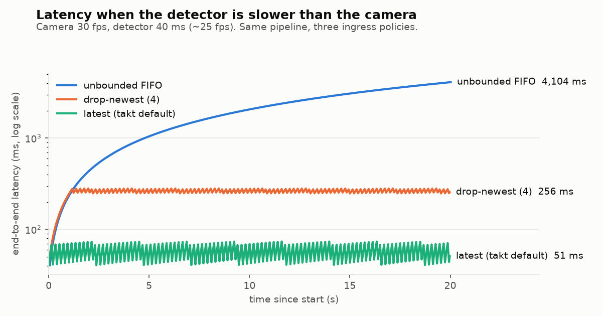
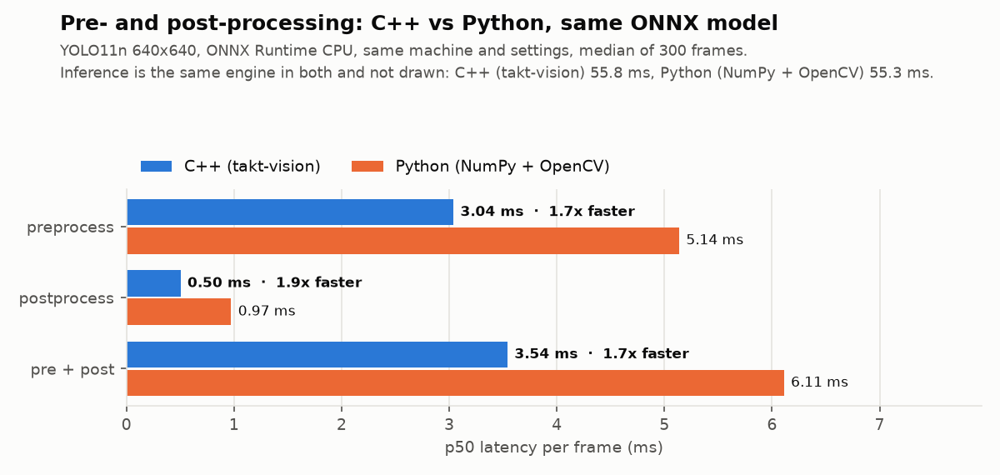

# takt-vision

**A real-time C++20 vision inference pipeline for edge devices:** camera to detections to tracked
objects, with bounded latency you can measure.

[](https://github.com/GBR-RL/takt-vision/actions/workflows/ci.yml)
[](https://github.com/GBR-RL/takt-vision/actions/workflows/demo.yml)


*Takt time* is the pace a production line runs at. A vision system on that line has to answer
within it every time, not just on average. takt-vision is the runtime between the camera and the
decision: preprocessing, inference (ONNX Runtime today, TensorRT next), decoding, NMS and
multi-object tracking. Each stage runs on its own thread, connected by lock-free hand-offs, with
no heap allocation per frame and p99 latency reported for every stage.

<picture>
  <source media="(prefers-color-scheme: dark)" srcset="docs/assets/overload-dark.png">
  
</picture>

*When the detector cannot keep up with the camera, a naive queue's latency grows without bound.
takt-vision sheds stale frames right in front of the bottleneck. Reproduce it with
`scripts/overload_experiment.sh`; no model or GPU needed.*

## Highlights

- **Pipelined:** capture, preprocess, inference, postprocess + tracking and output each run on
  their own thread. Throughput approaches 1 / (slowest stage), not 1 / (sum of stages).
- **Latency-aware:** three hand-off policies (`latest`, `drop-newest`, `block`), a wait-free
  triple-buffer mailbox, and load shedding in front of the bottleneck.
- **Allocation-free steady state:** pooled frames recycled by a custom `unique_ptr` deleter. A test
  counts heap allocations across all threads and asserts zero.
- **Correct under concurrency:** a lock-free SPSC ring using C++20 `atomic::wait` (no spinning),
  checked by ThreadSanitizer in CI.
- **Measured:** HdrHistogram-style latency histograms (wait-free, ≤1.6 % error). p50/p95/p99 per
  stage and end to end, live in the overlay HUD and in JSON reports.
- **Tracking:** ByteTrack with a Kalman filter on compile-time-sized matrices and gated optimal
  assignment, verified against brute force.
- **Pluggable engines:** a C++20 concept plus type erasure. ONNX Runtime (CPU/CUDA) and a
  deterministic fake backend are included; TensorRT is planned.
- **Portable:** the core depends only on the standard library. CI builds with GCC and Clang on
  x86-64 and ARM64 (the Raspberry Pi 5 class), with ASan, UBSan and TSan.

## Quick start

```bash
git clone https://github.com/GBR-RL/takt-vision && cd takt-vision
cmake --preset release            # downloads ONNX Runtime for your platform
cmake --build --preset release
ctest --preset release

# No model needed: synthetic camera + simulated 20 ms detector
./build/release/apps/takt_run --backend fake --fake-latency-ms 20

# Real model (Python with ultralytics for the one-off export)
pip install ultralytics onnx
python scripts/export_yolo.py --weights yolo11n.pt --out models
./build/release/apps/takt_run --model models/yolo11n.onnx --source 0 --show            # webcam
./build/release/apps/takt_run --model models/yolo11n.onnx --source video.mp4 --out-video out.mp4
```

Requirements: CMake ≥ 3.25, a C++20 compiler (GCC ≥ 13, Clang ≥ 17, MSVC 19.38+), Ninja.
OpenCV (`libopencv-dev`) is optional and enables camera/video input and the overlay.

## Results

All numbers come from the [Demo & benchmarks](.github/workflows/demo.yml) workflow on a
GitHub-hosted runner (4 vCPU AMD EPYC 7763, Ubuntu 24.04, ONNX Runtime 1.30 CPU). Edge-device
numbers follow in [milestone M4](docs/IMPLEMENTATION_PLAN.md).

**Latency under overload** (camera 30 fps, detector 40 ms ≈ 25 fps, 20 s):

| Ingress policy | End-to-end p50 | p99 | Frames dropped |
|---|---:|---:|---:|
| `latest` (default) | **57 ms** | **74 ms** | 101 / 600 |
| `drop-newest`, depth 4 | 266 ms | 281 ms | 96 / 600 |
| unbounded FIFO (`block`, depth 256) | 2,081 ms, still growing | 4,096 ms | 0 / 600 |

With `latest`, a frame waits on average half an inference period plus one inference: the
theoretical floor for a single detector.

**Engineering checks on every push:** 86 tests pass on x86-64 and ARM64. ThreadSanitizer
reports no races across 80 tests, AddressSanitizer and UBSan are clean, and the steady-state
pipeline makes **0 heap allocations per frame** across all threads.

<picture>
  <source media="(prefers-color-scheme: dark)" srcset="docs/assets/cpp_vs_python-dark.png">
  
</picture>

*Same model, same ONNX Runtime settings, same machine. Inference is identical by construction.
takt-vision is 1.7× faster on the stages it implements: 3.5 ms vs 6.1 ms per frame, most of it the
fused letterbox. The Python baseline is not naive (its resize and NMS already run in OpenCV's
C++), so this is the honest size of the win. A SIMD letterbox is next in the plan.*

**When does pipelining pay off?** On this 4-vCPU runner, pipelined and sequential throughput are
equal (17.0 vs 16.9 fps): CPU inference is ~93 % of each frame and competes with the other stages
for the same cores. Pipelining pays off when inference runs on an accelerator (GPU, NPU, Hailo)
and the CPU stages become the bottleneck. That is the next measurement, on a Raspberry Pi 5 and a
Jetson ([design notes](docs/DESIGN_NOTES.md#pipelining)).

## How it works

```
 camera ──▶ [HandOff] ──▶ preprocess ──▶ [HandOff] ──▶ inference ──▶ [HandOff] ──▶ decode+NMS+track ──▶ [HandOff] ──▶ sinks
            latest slot    fused letterbox               ONNX Runtime                ByteTrack                        video · JSON · window
   ▲                                                                                                                        │
   └──────────────────────────────── FramePool (preallocated, recycled by RAII) ◀───────────────────────────────────────────┘
```

- [Architecture](docs/ARCHITECTURE.md): components, threads, frame lifecycle, shutdown and failure
- [Design notes](docs/DESIGN_NOTES.md): the decisions behind the code and the measurements
  backing them
- [Implementation plan](docs/IMPLEMENTATION_PLAN.md): milestones, status and what comes next
- [Demos](docs/DEMOS.md): how to reproduce every chart and video

## Repository layout

| Path | Contents |
|---|---|
| `include/takt/`, `src/` | The library: `core`, `vision`, `track`, `infer`, `pipeline`, `io` |
| `apps/` | `takt_run` (pipeline CLI) and `takt_bench` (per-stage latency) |
| `tests/` | GoogleTest suite: concurrency, geometry, tracking, pipeline, zero-allocation, ONNX end-to-end |
| `bench/` | Google Benchmark micro-benchmarks |
| `scripts/` | Model export, Python baseline, charts, overload experiment |
| `.github/workflows/` | CI matrix and the demo/benchmark workflow |

## Roadmap

Core pipeline, tracking and ONNX Runtime are done. Next: parity test against Ultralytics,
Raspberry Pi 5 numbers, a SIMD letterbox kernel, a TensorRT backend with FP16/INT8, and a ROS 2
node. See the [implementation plan](docs/IMPLEMENTATION_PLAN.md).

## License

MIT for this repository. Model weights exported with `scripts/export_yolo.py` come from
Ultralytics under AGPL-3.0 and are not distributed here.
