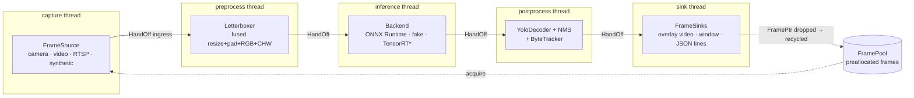

# Architecture

## Data flow

\* planned (milestone M5)

Every arrow between threads is a `HandOff`: a lock-free single-producer/single-consumer
structure whose behaviour under load is set by the `IngressPolicy`:

| Policy | Ingress (camera side) | Internal hand-offs | Use when |
|---|---|---|---|
| `latest` (default) | triple-buffer mailbox | triple-buffer mailbox | freshest result matters (inspection, robotics) |
| `drop-newest` | bounded FIFO, reject when full | blocking FIFO | every *admitted* frame must be processed |
| `block` | bounded FIFO, stall the camera | blocking FIFO | offline processing; no frame may be lost |

## Components

| Layer | Header | Responsibility |
|---|---|---|
| core | `core/spsc_ring.hpp` | Bounded lock-free SPSC ring; blocking via C++20 `atomic::wait` |
| core | `core/latest_slot.hpp` | Wait-free triple-buffer "latest value" mailbox |
| core | `core/latency_histogram.hpp` | Log-linear histogram, wait-free record, ≤1.6 % percentile error |
| core | `core/image.hpp` | Strided image view + capacity-reusing owning image |
| vision | `vision/letterbox.hpp` | Ultralytics-compatible letterbox, fused single-pass kernel |
| vision | `vision/yolo_decoder.hpp` | YOLOv8/YOLO11 raw head decoding, both tensor layouts |
| vision | `vision/nms.hpp` | Greedy class-aware NMS, torchvision semantics |
| track | `track/small_matrix.hpp` | Compile-time-sized matrices, Cholesky solve |
| track | `track/kalman_filter.hpp` | Constant-velocity Kalman filter over (cx, cy, a, h) |
| track | `track/linear_assignment.hpp` | Gated Hungarian assignment (lapjv-equivalent gating) |
| track | `track/byte_tracker.hpp` | ByteTrack three-stage association |
| infer | `infer/backend.hpp` | `InferenceBackend` concept + type-erased `Backend` |
| infer | `infer/onnx_backend.hpp` | ONNX Runtime, CPU or CUDA execution provider |
| infer | `infer/fake_backend.hpp` | Deterministic stand-in with configurable latency |
| pipeline | `pipeline/frame_pool.hpp` | Preallocated frames, `unique_ptr` with recycling deleter |
| pipeline | `pipeline/hand_off.hpp` | Policy-selected hand-off (`std::variant` of ring / mailbox) |
| pipeline | `pipeline/pipeline.hpp` | Threads, lifecycle, error propagation, metrics |
| io | `io/*` | Sources and sinks; OpenCV only here |

## Dependency rules

- `takt_core` depends on the C++ standard library only. It builds and tests anywhere,
  including CI runners with no GPU and no OpenCV.
- `takt_onnx` and `takt_opencv` are optional adapters; the apps enable features at compile time.
- Each stage object (letterboxer, backend, decoder, NMS, tracker) is used by exactly one thread,
  so none of them needs a lock. Shared state is limited to the hand-offs, the frame pool's free
  list and the metrics (atomics).

## Lifecycle of a frame

1. Capture thread acquires a frame from the pool (blocking, cancellable via `stop_token`).
2. The source writes pixels into the frame's image buffer (reused; no allocation).
3. `HandOff::push` admits, replaces or rejects it according to the policy; a displaced frame's
   `FramePtr` is destroyed, which returns it to the pool.
4. Each stage pops, works in place on the frame's preallocated buffers, and pushes onward.
5. The sink thread delivers it to all sinks, records end-to-end latency, and drops the
   `FramePtr`: back to the pool.

## Shutdown and failure

- **Stop** (`request_stop`, Ctrl-C, end of source, `max_frames`): the capture loop ends and
  closes the ingress. Each stage drains its input, then closes its output, so shutdown ripples
  through in order and every admitted frame is still delivered.
- **Failure** (exception on any thread): the first exception is stored, every hand-off is
  closed, stages drain without processing, and `run()` rethrows on the caller's thread after
  all threads have joined. Nothing leaks: frames are owned by RAII pointers throughout.
